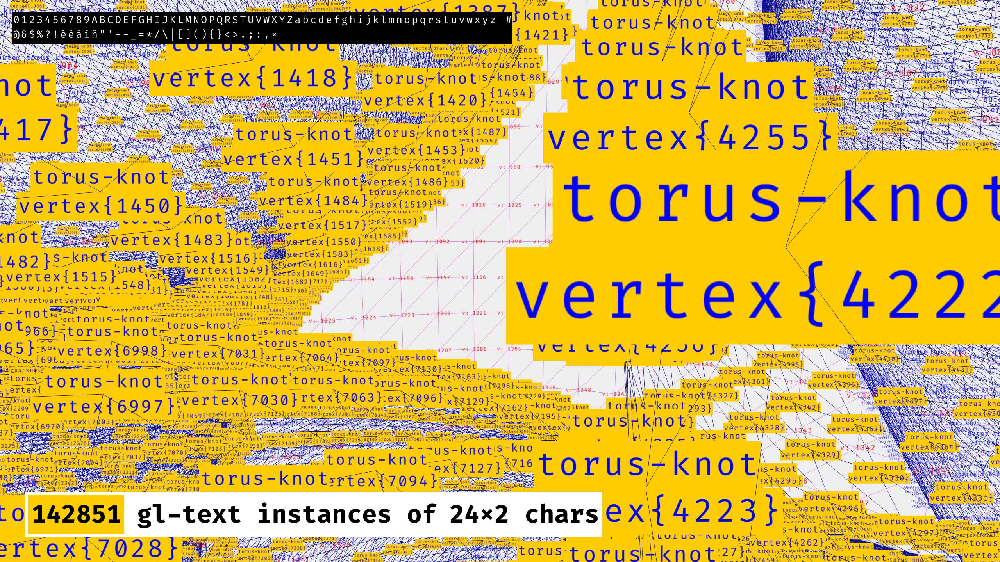

# gl-text

`gl-text` is for rendering an insane number (> 100K) of small texts (max 48 chars) with ThreeJS, for
debugging purpose essentially (eg: Mesh inspection).

<a href="https://jniac.github.io/gl-text/test/stress/">
  
</a>

## Demo & Atlas

Demos:
- [basic](https://jniac.github.io/gl-text/test/basic/)
- [stress](https://jniac.github.io/gl-text/test/stress/)
- [offset](https://jniac.github.io/gl-text/test/offset/)

The atlas is made via `canvas.toDataURL()` from that page:
- [Atlas Generator](https://jniac.github.io/gl-text/atlas/)

## Features

- Colors:
  - text & background
  - with opacity!

- Multiple lines
  - up to 8 lines (but since only 48 chars ares supported, 3 or 4 is a maximum in real use cases).

- Billboard mode  
  - By default the text instances are facing the camera
  - But it can be prevented: `new GlText({ billboard: false })`

- Z fighting
  - By default a tiny "polygon offset" is enabled, and can be adjusted: 
    - `new GlText({ polygonOffsetFactor: -10, polygonOffsetUnits: -10 })`
  - Even better: a `cameraZOffset` option allows to shift the text directly to the camera!
    - `new GlText({ cameraZOffset: .5 })`

- Supports mipmaps
  - Because every chars is drawn through separated triangles (2 triangles actually)
    mimaps works without any troubles (it was not the case with previous technic
    using a single plane for multiple chars).

## Usage
```ts
const glText = new GlText({
  maxCount: 100_000, // default is 2000
  col = 16, // default is 12
  row = 3, // default is 2
  billboard = false, // default is true
})

scene.add(glText)

glText.setTextAt(0, 'foo', {
  position: new Vector3(4, 2, 1),
  color: 'red',
  background: 'yellow',
  size: 2,
})
```

## Info

The output (js, .d.ts + map) is generated (but not commited) in the lib folder.

## Dev

```
pnpm dev
```

